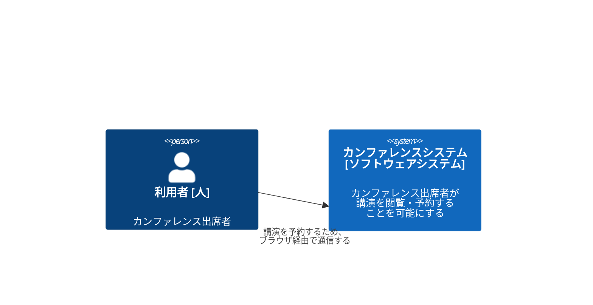
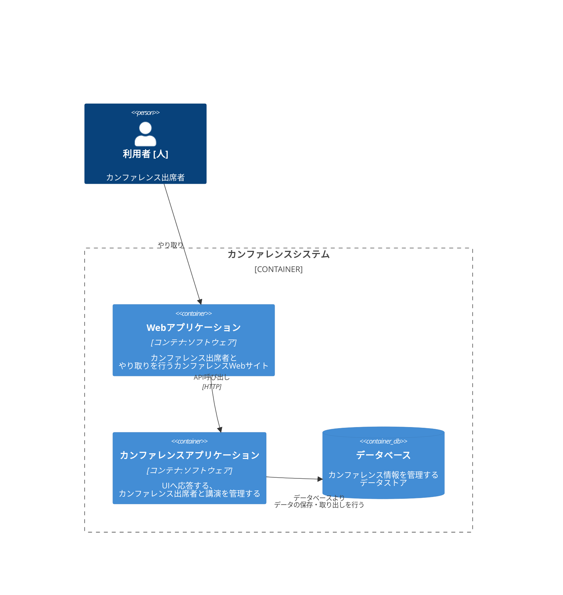
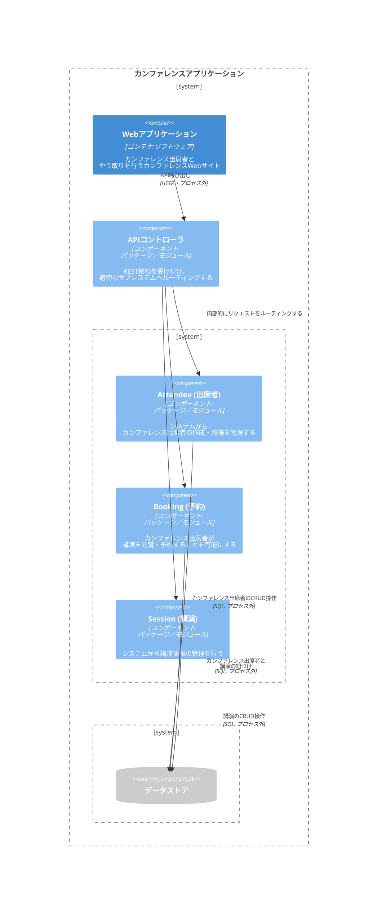

---
tags:
  - マスタリングAPIアーキテクチャ
---

[[C4モデル]] (https://c4model.com/) とはソフトウェアアーキテクトや開発者がソフトウェアをどのように考え、構築を行うか抽象化し、ソフトウェアアーキテクチャを図示するアプローチのこと。具体的には以下の[[#抽象化の考え方]]を前提としながら[[#4種類のダイヤグラム図]]を構築する。

[[UML]] の持つ「アーキテクトや開発者の記憶に残りづらい」という課題を簡略化された図によって解決？したものらしい。

## 抽象化の考え方

- [[ソフトウェアシステム]] ([[Software System]]) は (アプリケーション + データストア) によるコンテナで構成されている
- [[コンテナ]] (Container) はコンポーネントで構成されている
- [[コンポーネント]] (Components) はコード (Codes: クラス、インターフェース、オブジェクト、関数など) で構成されている

## 4種類のダイヤグラム図

ダイヤグラム図は以下の4種類を意味する。
- Context Diagram ([コンテキスト図](#コンテキスト図))
- Container Diagram ([コンテナ図](#コンテナ図))
- Component Diagram ([コンポーネント図](#コンポーネント図))
- Code Diagram (コード図)

### コンテキスト図

目的: 技術的な利用者と非技術的な利用者の両方に対してコンテキストを設定すること

多くのアーキテクチャに関する会話は低レイヤの詳細に行く傾向があるため、概論レベル (高レイヤ) におけるやり取りのコンテキスト説明を見落とさないようにする

### コンテナ図

[コンテキスト図](#コンテキスト図)がシステムの全体像を示すのに対し、[[コンテナ図]]はアーキテクチャ主要要素の技術的役割を説明する。

[[C4]] におけるコンテナは、「システム全体が動作するために必要なもの」と定義される。[[コンテナ図]]は[[コンテキスト図]]の下位に位置し、コンテキスト図を元に作成される。

### コンポーネント図

[[コンポーネント図]]は各コンテナ内の役割と責任、内部トラフィックを定義するのに役立つ。コードベースへの有用なマッピングを提供する。技術に囚われないように、「パッケージ／モジュール」という用語を用いている。

