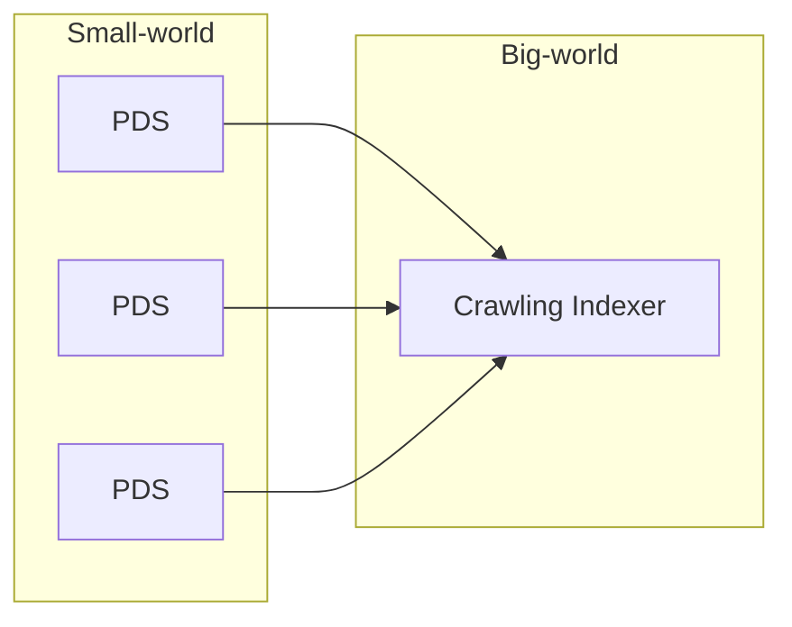

## AT Protocol とは
[[AT Protocol]] (Authenticated Transfer Protocol: atproto) とは、

- ドメインによって名前付けされた Personal Data Server (PDS)
- PDS のデータを同期する Crawling Indexer

という複数のプロトコルからなる集合の総称。

Bluesky クライアントが実行するデータ操作は、自分が所属する PDS に対して行う。

- sources
  - [The AT Protocol](https://atproto.com/)
  - [開発視点から見る、新しい分散型SNS「Bluesky」とAT Protocolの可能性 | gihyo.jp](https://gihyo.jp/article/2023/04/bluesky-atprotocol)
