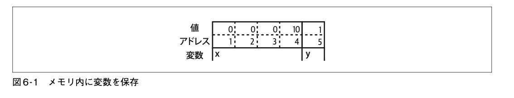
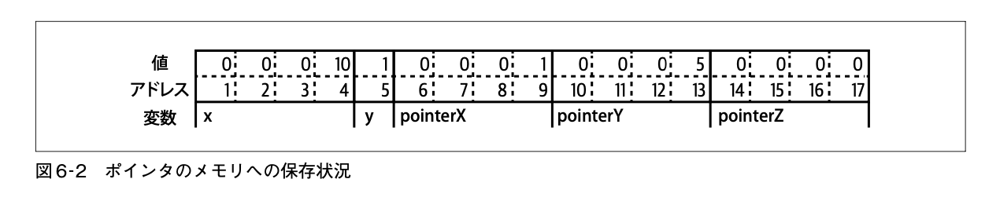

## ポインタ入門

[[ポインタ]]とは、ある値が保存されているメモリ内の位置を表す変数。

どの変数も、1バイトか複数バイトが連続したメモリに保存されており、その位置を「アドレス」と呼ぶ。変数の型が違うと保存に必要なメモリの量も異なる。32ビット整数は4バイト、ブール値は1バイトが必要。

```go
var x int32 = 10
var y bool = true
```



ポインタも変数であり、「別の変数が保存されているアドレス」を格納している。

```go
var x int32 = 10
var y bool = true
pointerX := &x
pointerY := &y
var pointerZ *string
```



- `x` へのポインタである `pointerX` はアドレス6に保存され、値は1
- `y` へのポインタである `pointerY` はアドレス10に保存され、値は5
- 最後のポインタである `pointerZ` はアドレス10に保存され、値は0 (何も参照していない)

[[ポインタ]]の[[ゼロ値]]は [[nil]]。スライス、マップ、関数、インタフェース、チャネルのゼロ値が nil であるのは、これらの型がすべてポインタで実装されているため。[[nil]] は値がないことを示す、型のない識別子。[^2024-12-16-092310]

[^2024-12-16-092310]: [[nil]] は[[ユニバースブロック]]で定義されているため、[[シャドーイング]]される可能性がある。そのため変数や関数に `nil` という名前を絶対につけてはならない。

### ポインタの演算子
- **`&`** … **[[アドレス演算子]]**。変数の前につけると、その変数のアドレスを返す。返された値は **[[ポインタ型]]** の値になる。
- **`*`** … **[[間接参照]]** のための演算子。[[ポインタ型]]の変数の前につけると、そのポインタが参照するアドレスに保存されている値を返す。これを **[[デリファレンス]]** (dereference, dereferencing) と呼ぶ。`nil` ポインタをデリファレンスしようとすると panic になる。

```go
x := 10
pointerToX := &x
fmt.Println(pointerToX)  // => アドレス (e.g. 0xc000012070) が表示される
fmt.Println(*pointerToX) // => 10
z := 5 + *pointerToX
fmt.Println(z)           // => 15
```

ポインタ型の変数を `var` を使って宣言するときは、「そのポインタが指す領域に保存される値の型」の前に `*` をつけて表す。

```go
x := 10
var pointerToX *int
pointerToX = &x
```

組み込みの関数 `new` はポインタ型の変数を生成する。指定された型でゼロ値の値のインスタンスへのポインタを返す。

```go
var a = new(int)
fmt.Println(a == nil) // false
fmt.Println(*a) // 0
```

source: [[『初めてのGo言語』]]
