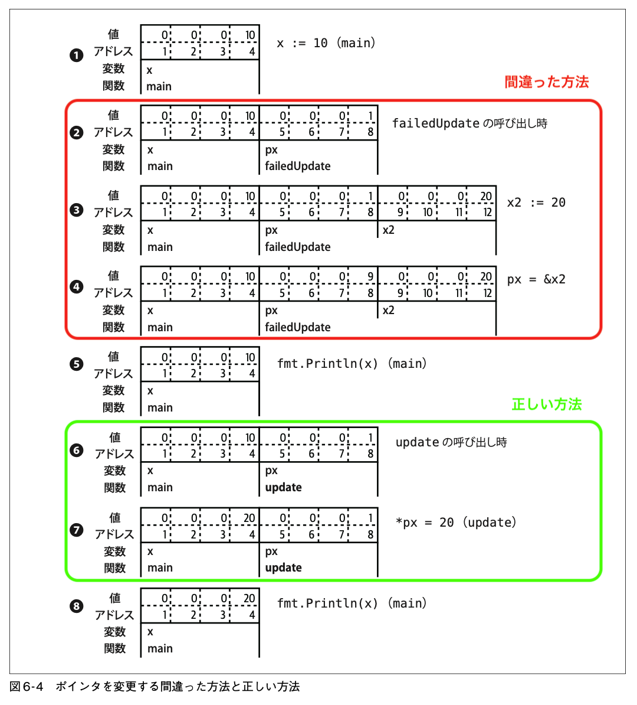

---
tags:
  - 初めてのGo言語
---

## ポインタ入門

[[ポインタ]]とは、ある値が保存されているメモリ内の位置を表す変数。

どの変数も、1バイトか複数バイトが連続したメモリに保存されており、その位置を「アドレス」と呼ぶ。変数の型が違うと保存に必要なメモリの量も異なる。32ビット整数は4バイト、ブール値は1バイトが必要。

```go
var x int32 = 10
var y bool = true
```


ポインタも変数であり、「別の変数が保存されているアドレス」を格納している。

```go
var x int32 = 10
var y bool = true
pointerX := &x
pointerY := &y
var pointerZ *string
```


- `x` へのポインタである `pointerX` はアドレス6に保存され、値は1
- `y` へのポインタである `pointerY` はアドレス10に保存され、値は5
- 最後のポインタである `pointerZ` はアドレス10に保存され、値は0 (何も参照していない)

[[ポインタ]]の[[ゼロ値]]は [[nil]]。スライス、マップ、関数、インタフェース、チャネルのゼロ値が nil であるのは、これらの型がすべてポインタで実装されているため。[[nil]] は値がないことを示す、型のない識別子。[^2024-12-16-092310]

[^2024-12-16-092310]: [[nil]] は[[ユニバースブロック]]で定義されているため、[[シャドーイング]]される可能性がある。そのため変数や関数に `nil` という名前を絶対につけてはならない。

### ポインタの演算子
- **`&`** … **[[アドレス演算子]]**。変数の前につけると、その変数のアドレスを返す。返された値は **[[ポインタ型]]** の値になる。
- **`*`** … **[[間接参照]]** のための演算子。[[ポインタ型]]の変数の前につけると、そのポインタが参照するアドレスに保存されている値を返す。これを **[[デリファレンス]]** (dereference, dereferencing) と呼ぶ。`nil` ポインタをデリファレンスしようとすると panic になる。 ^719c3d

```go
x := 10
pointerToX := &x
fmt.Println(pointerToX)  // => アドレス (e.g. 0xc000012070) が表示される
fmt.Println(*pointerToX) // => 10
z := 5 + *pointerToX
fmt.Println(z)           // => 15
```

ポインタ型の変数を `var` を使って宣言するときは、「そのポインタが指す領域に保存される値の型」の前に `*` をつけて表す。

```go
x := 10
var pointerToX *int
pointerToX = &x
```

組み込みの関数 `new` はポインタ型の変数を生成する。指定された型でゼロ値の値のインスタンスへのポインタを返す。

```go
var a = new(int)
fmt.Println(a == nil) // false
fmt.Println(*a) // 0
```

Go で関数 `new` はほとんど使われず、代わりに `&` が用いられる。構造体の場合は構造体リテラルの前に `&` をつける。[[基本型]]のリテラル (数、ブール値、文字列) や定数の場合は前に `&` をつけることができない[^2024-12-17-081216]ため、基本型のポインタが必要な場合はまず基本型の変数を宣言し、それを参照するポインタ変数を宣言する必要がある。

[^2024-12-17-081216]: [[基本型]]のリテラルや定数はコンパイル時にのみ存在し、メモリ内へのアドレスを持たないため。

## ポインタはミュータブルの印

Goでは定数以外に値が[[イミュータブル]]であることを宣言する仕組みがない。その代わりにGoではポインタを使って引数が[[ミュータブル]]であることを示す。

Goは[[値渡し]]の言語なので、関数に渡される値はコピー。基本型、構造体、配列という非ポインタ型では関数は元のデータを変更できない。

それに対して関数にポインタを渡すと、関数はポインタのコピーを受け取る。コピーも同じデータを参照するため、関数側で元データが変更可能になる。ポインタ型引数に代入された値が関数終了後も消えずに残っていてほしい場合は、ポインタを[[#^719c3d|デリファレンス]]して値を設定しなければならない。

```go
func failedUpdate(px *int) {
	x2 := 20
	px = &x2
}

func update(px *int) {
	*px = 20
}

func main() {
	x := 10
	failedUpdate(&x)
	fmt.Println(x) // 10
	update(&x)
	fmt.Println(x) // 20
}
```

このコードの実行時に起こっている変化は下図のとおり。



### nilポインタは更新できない

関数にポインタとして [[nil]] を渡した場合、その値は `nil` 以外に変えることができない[^2024-12-21-131431]。

[^2024-12-21-131431]: 書籍内ではポインタのコピーを渡している関数 (`failedUpdate`) を例として挙げているが、それは「nilポインタが更新できない例」ではなく「デリファレンスしなければならない例」では？？


```go
func update(px *int) {
	*px = 10
}

func main() {
	var f *int
	update(f) // panic: runtime error: invalid memory address or nil pointer dereference
	fmt.Println(f)
}
```
