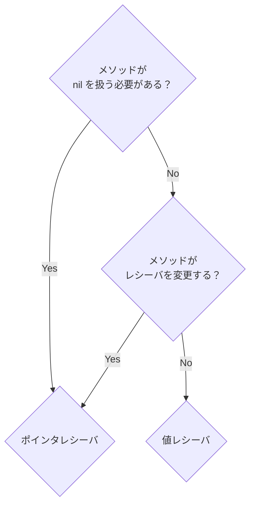

## メソッド

Goは[[ユーザー定義型]]に付随する関数を定義できる。これを **[[型メソッド]]** (type method) あるいは単に **[[メソッド]]** (method) と呼ぶ。

メソッドの宣言は[普通の関数の宣言](Goの関数.md#関数の宣言)とよく似ているが、`func` とメソッド名の間に **[[レシーバ]]** (receiver) が追加されている。

```go
type Person struct {
	FirstName string
	LastName  string
	Age       int
}

// 型 Person に付随するメソッド String を定義 (Person にメソッド String を追加)
func (p Person) String() string {
	return fmt.Sprintf("%s %s : 年齢%d歳", p.LastName, p.FirstName, p.Age)
}
```


```go
func main() {
	p := Person{
		LastName:  "武田",
		FirstName: "信玄",
		Age:       52,
	}

	output := p.String()
	fmt.Println(output) // 武田 信玄 : 年齢52歳
}
```

## ポインタ型レシーバと値型レシーバ

レシーバには **[[ポインタレシーバ]]** と **[[値レシーバ]]** の2種類がある。

どちらの種類のレシーバを使うか決めるためのルールは次の通り。



- メソッドがレシーバを変更する場合はポインタレシーバを **使わなければならない**
- メソッドが `nil` を扱う必要があれば、ポインタレシーバを **使わなければならない**
- メソッドがレシーバを変更しないなら値レシーバを **使うことができる**
  - 型にポインタレシーバのメソッドが1つでもあれば、(レシーバを変更しないものも含め) すべてのメソッドにポインタレシーバを使う[^2024-12-20-075542]

[^2024-12-20-075542]: https://go.dev/wiki/CodeReviewComments#receiver-type に "- Don’t mix receiver types. Choose either pointers or struct types for all available methods." とあったが、理由は書かれていない。<br>[【Go】値レシーバとポインタレシーバの違いと使い分けについて考える \#Go - Qiita](https://qiita.com/fujita-goq/items/ed8e8730b0976c3ff3a6) には「一つの型で値レシーバとポインタレシーバを混在させない（**統一性のため**）」とある。

ポインタレシーバに対してポインタでないローカル変数を渡すと、Goは自動的に変数をポインタ型に変換する。[pointer_and_value_receivers.go](example/pointer_and_value_receivers.go) の例で言えば `c.Increment()` は `(&c).Increment()` に自動変換されて呼び出される。

```go
% go run go/example/pointer_and_value_receivers.go
合計: 0, 更新: 0001-01-01 00:00:00 +0000 UTC
合計: 1, 更新: 2024-12-20 08:10:13.068416 +0900 JST m=+0.000084043
```


source: [[『初めてのGo言語』]]
