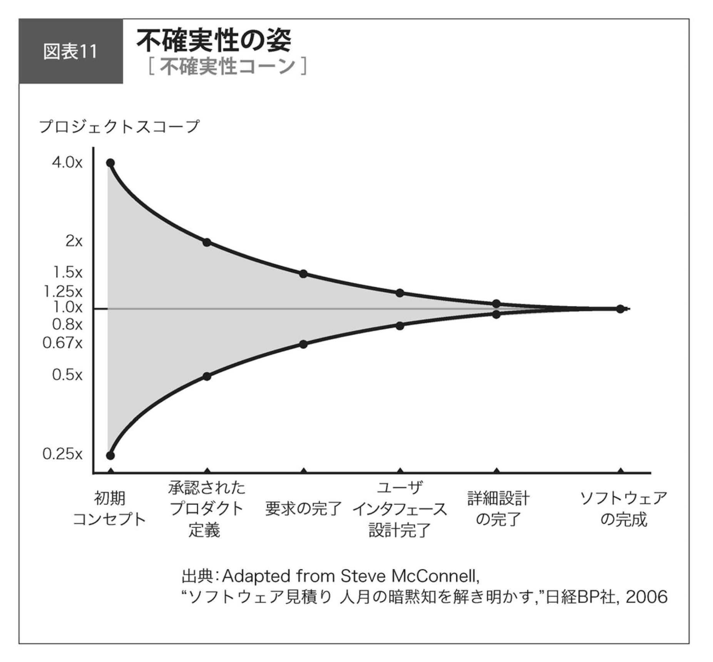

---
tags:
  - 誰も教えてくれない計画するスキル
---

## プロジェクトとは

- [[計画プロセス]]を知るには[[プロジェクト]]とは何かを知らなければならない
- [[PMBOK]] [^2024-12-23-230818]第5版によるプロジェクトの定義 … 「独自のプロダクト、サービス、所産[^2024-12-23-230959]を創造するために実施される有期性のある業務」
- プロジェクトの3つの特徴
  - **独自性**
    - プロジェクトには繰り返しがない
    - e.g. 家を立てるのはプロジェクト、車の生産ラインは not プロジェクト
  - **有期性**
    - プロジェクトには始まりと終わりがある
    - 納期がある
  - **決められたスコープ**
    - やらないといけないことが決まっている
- PMBOK のプロジェクト定義を言い換え … 「やったことがないことを、何が起こるか分からないのに計画して、予定通りのモノ（コト）を期限までに作る（達成する）こと」
  - やったことがないことを何が起こるか分からないのに計画して終わらせますと約束するのがプロジェクト

[^2024-12-23-230959]: 「ある事の結果として生み出されたもの。作り出したもの。」ref: [所産（しょさん）とは？ 意味・読み方・使い方をわかりやすく解説 - goo国語辞書](https://dictionary.goo.ne.jp/word/%E6%89%80%E7%94%A3/)

[^2024-12-23-230818]: Project Management Body of Knowledge の頭字語。[[プロジェクトマネジメント]]の知識体系。

### プロジェクトには「不確実性」がある

- [[不確実性]]とは、「やってみないとわからない」こと
- [[不確実性コーン]]
  
  - 不確実性の姿を表す
  - 横軸 … 時間経過
  - 縦軸 … そのタイミングでのプロジェクトの「見積もり」
  - 初期コンセプトのタイミングでは見積もりに16倍の開きがある

### 見積もりには正解も不正解もない

  - プロジェクトはやってみないとわからない
    - 開始時は何が起こるか分からない
    - どういうふうにやればいいかも分からない
    - 見積もりは人によって、経験によって、知識によって、その人のマインドによって、かなり違ってくる
    - リスクを考慮して余裕を持った計画を立てたい
      - 上司[^2024-12-23-232823]が許さない
        - 「それでやります」と言うしかない
          - [正解が分からない](#プロジェクトには「不確実性」がある)から「プロジェクト燃える、終わるわけない」と思いながらも強く言えない

[^2024-12-23-232823]: 上司、上長、営業、etc.
経験豊富な人の「分からない」しか上に聞いてもらえない気がしている。これが信頼だろうか。「分からない **から** 〜しましょう」と建設的に言えることが必要？

### デスマーチはいつ終わるか分からない
- [[デスマーチ]]とはプロジェクトがコントロールを失い、どうすれば結果が出る (終わる) のか分からなくなった状況のこと
  - 「今夜 (今週) はデスマーチ」というのは、「いつ終わる」かが見えている時点でデスマーチではない
- [[不確実性]]を保ったままプロジェクトが進むとデスマーチに陥る
- 不確実性のないプロジェクトは存在しない
  - やったことがないことをやるから価値がある
  - リスクを取るから顧客に価値を提供でき、市場に受け入れられたときに成果が生まれる
  - つまり **[[不確実性]]が成果を生む**
- [[不確実性]] (リスク、波) はなくせない → なら乗りこなすしかないという発想が必要

## 不確実性を乗りこなす

- 不確実性を乗りこなすための3つのアプローチ
  - **不確実性そのものを小さくする**
    - プロジェクトマネジメントプロセスの整備
    - 組織成熟度の向上
      - プロセスを組織的に標準化
      - プロセスを使いこなせるように人材を教育
    - 3〜5年かかる
      - 効果は大きいので地道にやっていく
  - **徐々に不確実性を小さくする**[^2024-12-25-083146]
    - 今わかっていることで計画を立てる
      - 意思決定すれば不確実性は減る
    - 情報が見えてきたら次の計画を立てる
      - わかった時点で修正する[^2024-12-25-083821]
    - 段階的に詳細化していく
  - **衝撃に備える**
    - 計画外のトラブルや事象に対してあらかじめリスク対策を講じる
      - もしくはバッファを取る
    - 計画があって初めて機能する
- 最初は取り組みやすく即効性がある「徐々に不確実性を小さくする」アプローチから
- 3つ同時に行うのは組織トップのコミットメントが必要
  - 自分のプロジェクトで成果を出して[[横展開]]するボトムアップ、ミドルアップダウンのアプローチが吉

[^2024-12-25-083146]: この分け方はMECEか？1つ目も2つ目も不確実性を小さくしている…。

[^2024-12-25-083821]: エンジニアにも必要なスタンス。着手してみて当初の見積もりと違いそうな場合はすぐにPM (PJM) に修正後の値を報告する。